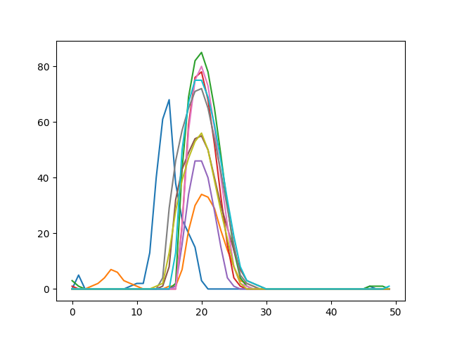
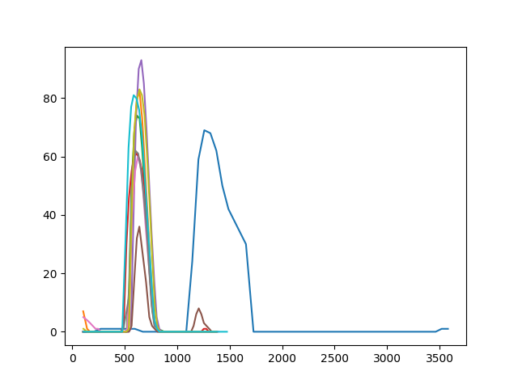
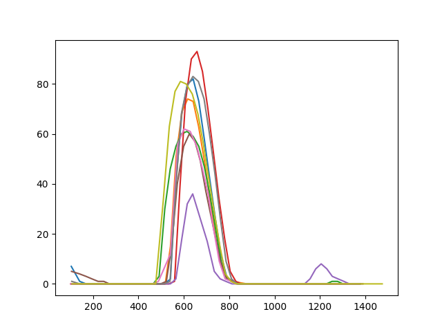
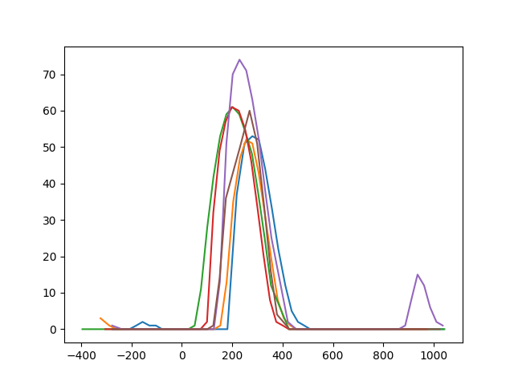
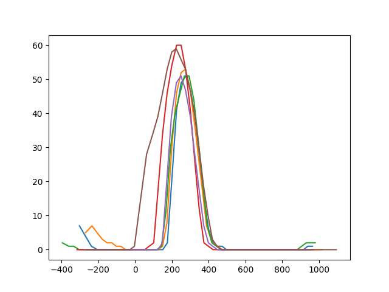

# Poročilo o delu z merilnikom za prah na IJS

V okviru poletnega dela na Inštitutu Jožef Stefan sem obravnaval delovanje senzorja prašnih delcev Sharp GP2Y1010AU0F. Vnaprej pripravljeno vezje in program prižgeta infrardečo LED in v izmerita odziv foto tranzistorja v 50 točkah, raztresenih prek približno 1.4ms. To počneta s poljubno frekvenco med 1 in 100 Hz. Meritve izgledajo relativno neurejene in neuporabne za interpretacijo:

V nadaljevanju je kronološko opisan potek poskusov izboljšav ter interpretacije meritev.

Vse meritve so, če ni drugače napisano, opravljene s frekvenco 5Hz v časovnem okvirju 1.5s.

### 1. Frekvenca delovanja
Proizvajalec navaja 100Hz kot maksimalno frekvenco zajemanja meritev. Izkaže se, da vezje, zaradi hitrosti polnjenja in praznjenja kondenzatorja, ne zmore opravljati meritev bistveno hitreje kot z 10Hz.

### 2. Neenakomerno odčitavanje vrednosti iz foto tranzistorja
Časovna razlika med posameznimi odčitki vrednosti na foto tranzistorju se je pokazala kot zelo neenakomerna. V ta namen je bil poleg vrednosti za vsako točko dodan še relativni čas meritve glede na začetek pulza infrardeče LED. Meritve, poravnane po času, izgledajo bistveno bolje.

Ugotovili smo tudi, da vsaka prva meritev (na zgornji sliki modra) zelo močno odstopa od vseh ostalih. To zato kar vedno izbrišemo:

### 3. Kakovost vzorca in motnje iz okolice
Vrhovi posameznih meritev še vedno kar precej odstopajo eden od drugega, kar pa je morda posledica realnega stanja, ne pa napake meritve. Da bi zagotovili bolj homogeno mešanico zraka, uporabimo ventilator:

Še boljše rezultate pa dobimo, če senzor in ventilator postavimo v popolno temo:

Iz tega sklepamo, da svetlobne motnje iz okolja močno vpljivajo na rezultat meritev.

### 4. Iskanje pravega vrha

## Končne ugotovitve in nasveti za uporabo:
- Meritev ni mogoče opravljati hitreje kot z 10Hz.
- Meritve morajo biti poravnane reletivno glede na čas prižiga IR LED.
- Senzor mora biti postavljen v temo in imeti konstanten pretok zraka.
- 
